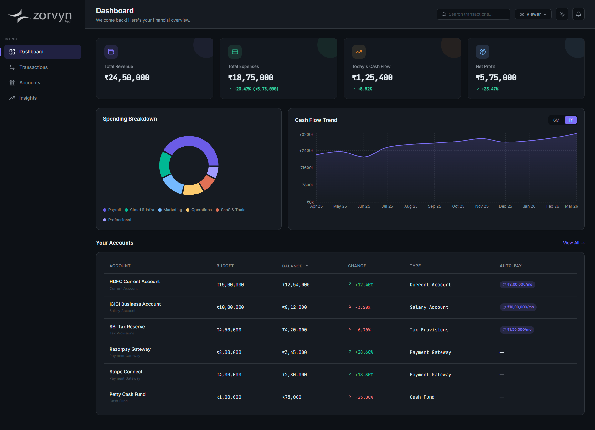
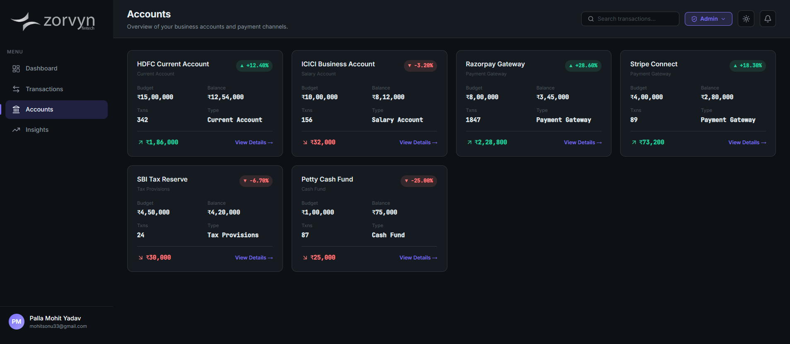
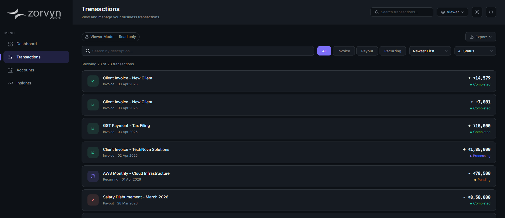
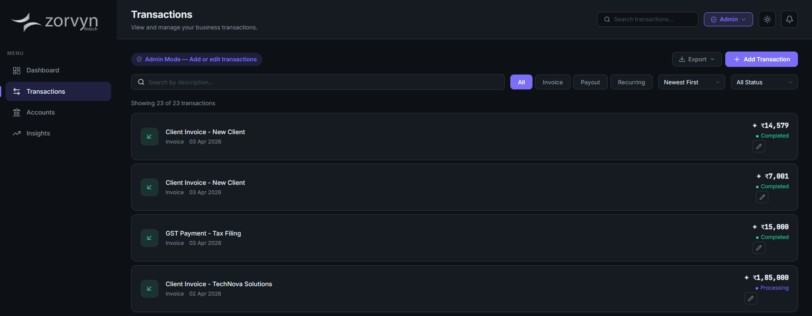
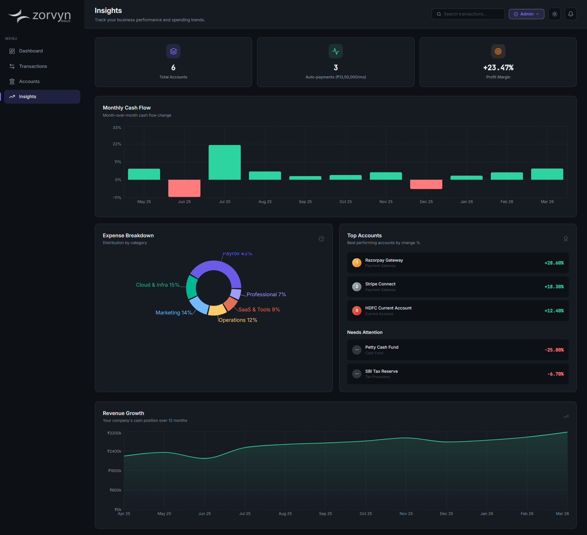

# zorvyn — Finance Dashboard UI

<p align="center">
  
</p>

<p align="center">
  A clean, interactive finance dashboard built for the Zorvyn Frontend Intern assignment.<br/>
  Track revenue, expenses, transactions, and cash flow insights.
</p>

<p align="center">
  
  
  
  
  
</p>

## 🔗 Live Demo

[View Dashboard →](https://financial-dashboard-ui-one.vercel.app/)

---


## Requirement Coverage

### 1. Dashboard Overview ✅
- 4 summary cards: Total Revenue, Total Expenses, Today's Cash Flow, Net Profit — each with animated count-up
- Spending Breakdown donut chart (6 categories)
- Cash Flow Trend area chart with 6M / 1Y toggle
- Sortable accounts table with clickable rows





### 2. Transactions ✅
- List with Date, Amount, Type (Invoice / Payout / Recurring), Status
- Search by description — also wired to global TopBar search
- Filter by type and status independently
- Sort by date or amount (4 options)
- Export as CSV or JSON (respects active filters)
- Empty state when no results match



### 3. Role-Based UI ✅
- TopBar toggle switches between **Viewer** (read-only) and **Admin** (full access)
- Viewer sees a lock badge, no add/edit controls anywhere
- Admin gets `+ Add Transaction` button and ✏️ edit on each row
- Both open a modal form → dispatches to global state
- Role managed via dedicated `RoleContext`



### 4. Insights ✅
- Monthly Cash Flow bar chart (green/red per month)
- Expense Breakdown donut with labels
- Top Accounts ranked 🥇🥈🥉 by performance
- "Needs Attention" section for underperforming accounts
- Revenue Growth area chart (12 months)
- Quick stats: Total Accounts, Active Auto-payments, Profit Margin



### 5. State Management ✅
Three contexts with clear separation:

| Context | Purpose |
|---|---|
| `PortfolioContext` | Financial data, transactions, notifications — `useReducer` with actions: `SET_DATA`, `ADD_TRANSACTION`, `EDIT_TRANSACTION`, `SELECT_FUND`, `MARK_NOTIF_READ` |
| `RoleContext` | Viewer/Admin role toggle |
| `themeContext` | Dark/Light mode with system preference detection |

Filter/sort logic encapsulated in `useFilteredTransactions` custom hook — keeps global state clean.

### 6. UI & UX ✅
- Responsive — sidebar collapses to hamburger on mobile, no horizontal overflow
- Dark/Light mode with system preference + localStorage
- Skeleton shimmer loading states on all pages
- Empty states with messaging when no data matches
- Smooth transitions, hover effects, count-up animations

---

## Optional Enhancements (all implemented)

| Enhancement | Details |
|---|---|
| Dark mode | System preference detection + localStorage persistence + TopBar toggle |
| Data persistence | Transactions saved to `localStorage`, restored on reload |
| Notifications | Bell icon shows live alerts when transactions are added/edited |
| Animations | Count-up on cards, skeleton shimmer, page fade-in, card hover lift |
| Export | CSV and JSON download from Transactions page (filter-aware) |
| Advanced filtering | Multi-dimensional: type + status + search + 4 sort modes |

---

## Tech Choices

| Tool | Why |
|---|---|
| React + Vite | Fast dev server, modern React without SSR overhead |
| CSS Modules | Scoped styling, no runtime cost, full control over design |
| Recharts | Lightweight charting with good React integration |
| Context + useReducer | Right-sized for this scope — Redux would be overkill for mock data |
| Lucide React | Modern, lightweight icon set |

---

## Project Structure

```
src/
├── components/
│   ├── common/        # Card, Badge, Loader (skeleton variants)
│   ├── dashboard/     # SummaryCards, PortfolioCharts, HoldingsTable
│   ├── transactions/  # TransactionList, AddTransactionModal
│   ├── funds/         # FundsList, FundPanel (slide-in detail)
│   ├── insights/      # InsightsView
│   └── layout/        # Sidebar, TopBar, Layout
├── context/           # PortfolioContext, RoleContext, themeContext
├── data/              # Mock JSON (portfolio, transactions, funds)
├── hooks/             # useFilteredTransactions
├── pages/             # Dashboard, Transactions, Funds, Insights
└── utils/             # formatters.js, exportData.js
```

---

## Running Locally

```bash
npm install
npm run dev
```

Opens at `http://localhost:3000`

---

## If I Had More Time

- Mock API with `json-server` or `msw` instead of static imports
- Date-range picker for transaction filtering
- PDF export of financial summaries
- Unit tests for hooks and utility functions
- PWA support for offline access

---

Built with determination and attention to detail.

---

## 💼 Other Projects

Here are a few other freelance and personal projects I've built:

- **[PartyNest](https://partynest.fun/)** — A dynamic e-commerce ticketing platform for event booking and management (Freelance Business Project).
- **[Nexmeridian](https://nexmeridian.com/)** — Modern business solutions and comprehensive digital experiences (Freelance Business Project).
- **[Paper Trading Indian Options](https://github.com/mohitsonu/PAPER-trading-Indian-Options)** — A simulated trading environment for the Indian options stock market.
- **[Automated Financial Rules](https://github.com/mohitsonu/Financial-Dashboard-UI?tab=readme-ov-file)** — A scalable rule engine for automatically executing conditional financial rules.
- **[Customer Churn Analysis Prediction](https://github.com/mohitsonu/Customer-Churn-Analysis-Prediction)** — Machine learning and data analytics project to predict customer retention.
